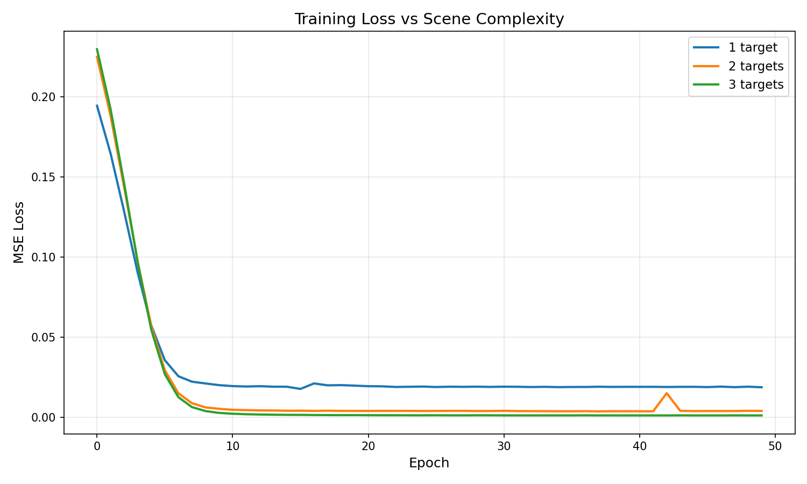
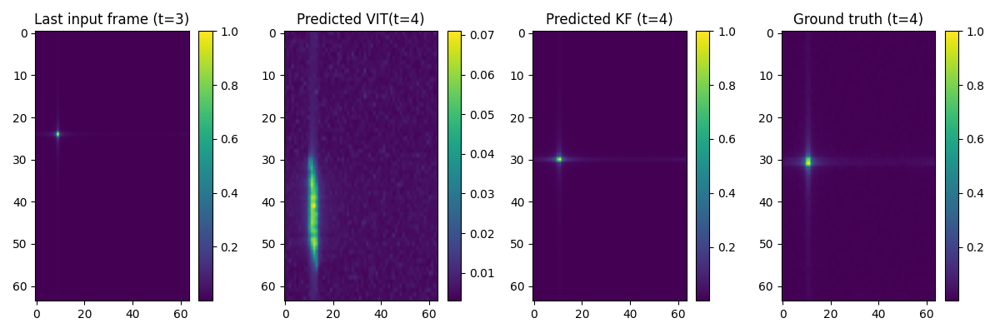
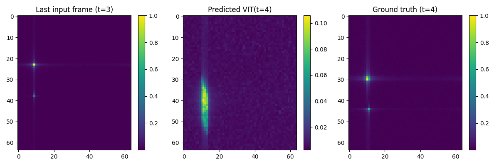

# Range-Doppler Map Prediction using Vision Transformers

## 1. Goal

This project investigates the application of Vision Transformers (ViT) for temporal prediction of FMCW radar Range-Doppler (RD) maps. Given a sequence of four consecutive RD maps (t=0,1,2,3), the model predicts the RD map at the next time instance (t=4).

---

## 2. Dataset and Problem Formulation

### Data Generation
- RD maps generated via 2D FFT of beat (IF) signals following FMCW radar principles
- Complex Gaussian noise (σ=0.01) added prior to FFT
- Range-dependent attenuation (1/R²) to reflect realistic signal propagation
- Constant acceleration motion model (a=1 m/s²) with random initial conditions

### Scenarios
1, 2, and 3-target scenes with varying ranges and velocities

### Task
Given RD maps at t=[0,1,2,3], predict the RD map at t=4

### Dataset Split
- Training: 500 sequences per scenario
- Testing: 100 sequences per scenario
- 50 training epochs

### Baseline
Kalman Filter with constant acceleration model for single-target comparison

---

## 3. Architecture: Vision Transformer for Sequence Prediction

The model consists of three sequential blocks:

### Block A: Spatial Encoder (ViT) - Understanding each RD Map

**Purpose:** Learn spatial relationships between patches in a single frame

**Input:** One RD map (1, 64, 64)

#### Step 1: Patchification and Flattening
- Each 64×64 RD map → 16 patches of 16×16 each
- Each patch flattened → vector of 256 values
- Output: (16, 256) - 16 patch vectors

> **Radar Interpretation:** Each patch corresponds to a localized region in range-Doppler space. Patchification preserves local energy patterns (e.g., Doppler peaks, noise) while allowing global reasoning in later layers.

#### Step 2: Linear Projection (Patch Embedding)
- Each patch (256-dim) × weight matrix (256×192) → embedding (192-dim)
- Learns to represent patch content as 192 abstract features
- Features capture: energy patterns, frequency content, spatial structure
- Output: (16, 192) - 16 patch embeddings

#### Step 3: Positional Embedding
- Add learned position vector (192-dim) to each patch embedding
- Position vectors initially random, learned during training
- Tells model: "Patch 1 is top-left, Patch 16 is bottom-right"
- Output: (16, 192) - 16 position-aware embeddings

#### Step 4: CLS Token
- Prepend special learnable token for aggregating information
- Output: (17, 192) - 1 [CLS] + 16 patches

> **Radar Interpretation:** The CLS token represents a scene-level summary, aggregating information across all range-Doppler regions.

#### Step 5: Transformer Encoder (6 layers)

Each layer contains:

**5a. Multi-Head Self-Attention (3 heads)**

Per head (operates on 64 dimensions):

1. **Create Q, K, V:**
   - Query: token × W_q → (64-dim)
   - Key: token × W_k → (64-dim)
   - Value: token × W_v → (64-dim)

2. **Compute Attention Scores:**
   - For each pair (i, j): score[i,j] = Q_i · K_j / √64
   - Apply softmax: attention_weights = softmax(scores)
   - All tokens can attend to all other tokens (no masking)

3. **Weighted Sum:**
   - For each token i: output_i = Σ(j=1 to 17) attention_weights[i,j] × value_j
   - Each token becomes weighted combination of all value vectors

4. **Output from one head:** (17, 64)

**Concatenate 3 heads:**
- Head 1: (17, 64)
- Head 2: (17, 64)
- Head 3: (17, 64)
- Concat → (17, 192)

> **Radar Interpretation:** Global attention enables interactions between distant range-Doppler regions. However, attention quality depends critically on scene structure - this becomes a key limitation for sparse single-target scenarios.

**5b. Add & Norm**
- Residual: output + input
- Layer normalization

**5c. Feed-Forward Network**
- Linear: 192 → 768 (expand 4x)
- GELU activation
- Linear: 768 → 192 (project back)

> **Radar Interpretation:** Refines each token's representation after global context has been incorporated.

**5d. Add & Norm**
- Residual: output + input
- Layer normalization

*Repeat 6 times (6 encoder layers)*

#### Step 6: Global Average Pooling
- Take all 17 tokens (17, 192)
- Average across tokens → (192,)
- Output: Single feature vector representing entire RD map

> **Critical Bottleneck:** This pooling operation compresses 3,072 values (17×192) into 192 values - a 16:1 compression ratio. Fine spatial detail (exact peak locations, multi-peak structure) is lost here.

#### Final Output from Block A
- Per frame: (192,) - one feature vector per RD map
- For sequence of 4 frames: (4, 192) - ready for Block B

*Note: Block A processes each frame independently. The same ViT encoder is applied 4 times (once per frame).*

---

### Block B: Temporal Encoder

**Purpose:** Learn temporal relationships across the sequence of frames

**Input:**
- 4 sequential time-frames (t=0, 1, 2, 3) where each frame represented by 192 features (from Block A)
- Dimension: (batch, 4, 192)

#### Step 1: Add Temporal Positional Encoding
- Each of 4 timesteps gets unique position vector (192-dim)
- Position vectors initially random, learned via backpropagation (MSE minimization)
- Element-wise addition: frame_features + temporal_position
- Output: (batch, 4, 192) - temporally-aware features

> **Radar Interpretation:** Distinguishes t=0 (oldest) from t=3 (most recent) to enable learning of temporal ordering and motion patterns.

#### Step 2: Transformer Decoder (6 sequential layers)

**Purpose:** Learn temporal patterns across the sequence

**2a. Multi-Head Self-Attention (3 heads)**

Per head (64 dimensions):
- Create Q, K, V for each of 4 timesteps
- Compute attention: Each timestep attends to all other timesteps (no masking)
- Output from each head: (batch, 4, 64)

Concatenate 3 heads: (batch, 4, 192)

**What it learns:**
- Constant velocity: "Target moved 10m→20m→30m → predict 40m"
- Acceleration: "Velocity increased 2→3→4 m/s → predict 5 m/s"
- Multi-target patterns: "Two objects moving independently"

> **Radar Interpretation:** Temporal attention captures motion dynamics. Unlike Block A (which processes single frames), Block B has more information to learn from - motion patterns across time provide meaningful relationships for attention to capture, even for single-target scenarios.

**2b. Add & Norm**
- Residual connection: output + input
- Layer normalization

**2c. Feed-Forward Network**
- Linear: 192 → 768 (expand 4x)
- GELU activation
- Linear: 768 → 192 (project back)

**2d. Add & Norm**
- Residual connection
- Layer normalization

*Repeat 6 times (6 decoder layers)*

#### Step 3: Extract Prediction Feature

After 6 layers: (batch, 4, 192)
- Processed features for all 4 timesteps
- Each timestep now understands full temporal context

Take last timestep: (batch, 192)
- Index [-1] of the sequence
- Represents: "Based on t=0,1,2,3, here's what should happen at t=4"

> **Why last timestep?** Through attention, the t=3 representation has "attended to" all previous frames (t=0,1,2). It contains information from the entire sequence but represents the most recent state - the ideal starting point for predicting t=4.

#### Output from Block B
- (batch, 192) - Single feature vector representing predicted state at t=4
- Ready for Block C (decoder) to reconstruct as RD map

---

### Block C: MLP Decoder - Reconstructing RD Map

**Purpose:** Convert the 192-dim feature vector for t=4 into a 64×64 RD map

#### Step 1: First Linear Layer + Activation
- Multiplied by weight matrix (192×512) to get feature vector of dim 512
- ReLU activation
- Output: (batch, 512)

#### Step 2: Second Linear Layer
- Multiplied by weight matrix (512×4096) to get feature vector of dim 4096
- Sigmoid activation - squashes values to [0,1] range
- Output: (batch, 4096)

#### Step 3: Reshape
- Reshape to (batch, 1, 64, 64)
- Final predicted RD map at t=4

> **Limitation of MLP Decoder:** The MLP treats all 4096 output pixels independently - no spatial structure or relationships are enforced. It simply learns a mapping from 192 features → 4096 pixel values without understanding that nearby pixels should be correlated (e.g., a peak should be localized, not scattered).

**Why this matters:** Combined with Block A's compression bottleneck (192-dim loses spatial detail), the MLP decoder cannot reconstruct sharp peaks. It produces spatially blurred predictions because:
1. Fine spatial information was lost in Block A pooling
2. MLP has no spatial inductive bias to guide reconstruction

*Alternative tested: CNN decoder (uses conv layers instead of linear layers to preserve spatial structure). However, experiments showed similar blur - confirming the bottleneck is in Block A's encoding, not the decoder choice.*

---

## 4. Kalman Filter Baseline (Single Target)

For comparison with classical approaches, we implemented a Kalman Filter with constant acceleration model.

### State Vector
```
x = [R, v, a]ᵀ
```

Where:
- R = range (meters)
- v = velocity (m/s)
- a = acceleration (m/s²)

### State Transition (Constant Acceleration)
```
R(t+1) = R(t) + v(t)·dt + 0.5·a(t)·dt²
v(t+1) = v(t) + a(t)·dt
a(t+1) = a(t)
```

### Process
1. Initialize with first observation: x₀ = [R₀, v₀, 0]
2. For t=0,1,2,3:
   - Predict: x̂(t) using state transition
   - Update: Correct with measurement [R(t), v(t)]
3. Predict t=4 without measurement
4. Generate RD map from predicted [R, v, a]

> **Limitation:** Kalman Filter designed for single target. Multi-target scenarios require data association (matching peaks across frames), which is non-trivial and beyond scope. The ViT model predicts the entire RD map directly, inherently handling multiple targets without explicit association.

---

## 5. Results and Analysis

### 5.1 Training Convergence



*Loss curves showing convergence by epoch 30-40 for all scenarios*

**Observations:**
- All models converge by epoch 30-40
- Training beyond epoch 50 shows no improvement
- Counterintuitively, loss decreases as target count increases (1→2→3 targets)

**Why does loss decrease with more targets?**

This appears backwards (more complexity should be harder), but it's a measurement artifact:

*Single target ground truth:*
- 1 sharp peak (value ≈ 1.0)
- 4095 background pixels (value ≈ 0)
- Model's blurred prediction has large squared error at peak location

*Multi-target ground truth:*
- Multiple peaks with varying amplitudes (0.3-1.0)
- Energy spread across more pixels
- Model's blurred prediction is "closer" to already-spread ground truth
- Lower MSE despite worse perceptual quality

> **Key Insight:** MSE loss is misleading for sparse multi-peak prediction. Low loss ≠ good prediction quality.

---

### 5.2 Single Target Results



*Comparison of ViT and Kalman Filter predictions for single-target scenario*

**Quantitative Comparison:**

| Method | MSE Loss | Peak Location |
|--------|----------|---------------|
| Kalman Filter | 0.003 | Sharper peak |
| ViT | 0.004 | Approximate region |

**Observations:**

ViT successfully learns temporal dynamics (Block B works well) but struggles with precise spatial localization (Block A bottleneck). Kalman Filter remains competitive for simple single-target scenarios where physics-based modeling is tractable.

Similar MSE occurs because noisy ground truth has energy spread across many pixels. ViT's blur matches this spread better than KF's sharp peaks, despite KF being qualitatively superior.

---

### 5.3 Two Target Results



*Two-target prediction showing merged blob instead of distinct peaks*

**Quantitative:** MSE Loss: 0.0006

**Observations:**
- Model learns "targets are somewhere in this region" but not "two peaks at exact positions X and Y"
- Despite low MSE loss (~0.004), the model cannot resolve individual targets
- The 192-dim bottleneck cannot encode precise locations of multiple peaks simultaneously
- This is an architectural limitation

---

### 5.4 Three Target Results


*Three-target prediction showing similar spatial blur*

**Observations:**
- Further degradation in spatial resolution
- Model predicts "activity in this general area" rather than distinct target locations

---

### 5.5 Takeaways

**Block A:**
- ViT attention wasted: 1 peak, 15 empty patches → nothing to learn
- Global pooling: 16:1 compression loses spatial detail
- Multi-target slightly better (attention has structure)

**Block B:**
- Temporal patterns rich even for single-target
- Learns motion correctly (velocity, acceleration)

**Block C:**
- MLP and CNN decoders both blur
- Can't recover info lost in Block A

---

## 6. Future Work

### Architectural Fixes
- CNN encoder for Block A (better for sparse scenes)
- Skip connections (preserve spatial detail)
- Larger embedding (192 → 768 dim)

### Loss Improvements
- L1 loss (encourages sparsity)
- Peak detection penalty (explicit localization)
- Perceptual loss (structural similarity)

### Advanced
- Dynamic attention (adaptive compute per patch)
- Hierarchical encoding (multi-scale features)

---

## Conclusion

Transformers excel at temporal reasoning (Block B) but struggle with sparse spatial encoding (Block A). Success requires matching architecture to data structure - for radar, this means acknowledging sparsity in design choices rather than applying vision architectures blindly.
